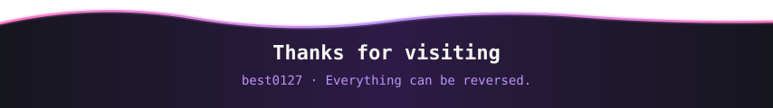

<!--
    ╔══════════════════════════════════════════════╗
    ║   best0127 · profile                          ║
    ║   theme: synthwave night / neon pink          ║
    ╚══════════════════════════════════════════════╝
-->

 

<table width="100%">
<tr>
<td width="55%" valign="top">

### 🙋‍♂️ About Me

- 🔍 主攻方向：**软件逆向 / 二进制分析 / 协议分析**
- 🐍 主力语言：**Python**，日常配合 Java 与脚本工具链
- 🪟 双栖用户：Windows & Linux，IDA / x64dbg / Ghidra 常客
- 🌱 正在深入：VM 保护对抗、自动化脱壳、CTF
- ⚡ 信念：*Everything can be reversed. Everything.*

### 🔗 Connect

</td>
<td width="45%" valign="top">

### 🛠️ Tech Stack

**Languages**

**Reversing**

**Toolchain**

</td>
</tr>
</table>

---

## 📊 贡献统计

---

## 🔥 连续贡献

---

## 🐍 Snake

<picture>
  <source media="(prefers-color-scheme: dark)" srcset="https://raw.githubusercontent.com/best0127/best0127/output/snake-dark.svg#gh-dark-mode-only" />
  <source media="(prefers-color-scheme: light)" srcset="https://raw.githubusercontent.com/best0127/best0127/output/snake.svg#gh-light-mode-only" />
  
</picture>

---

